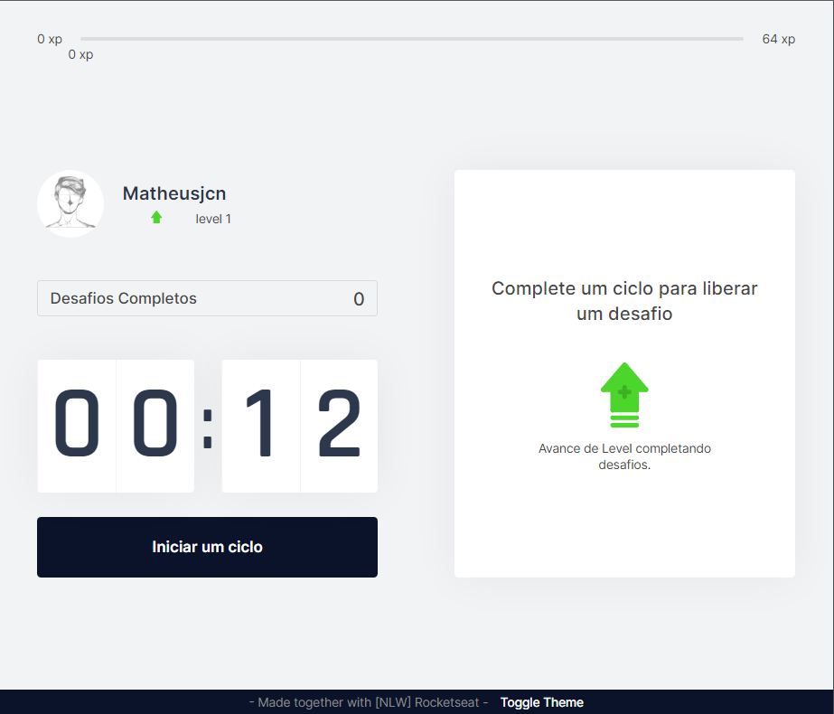
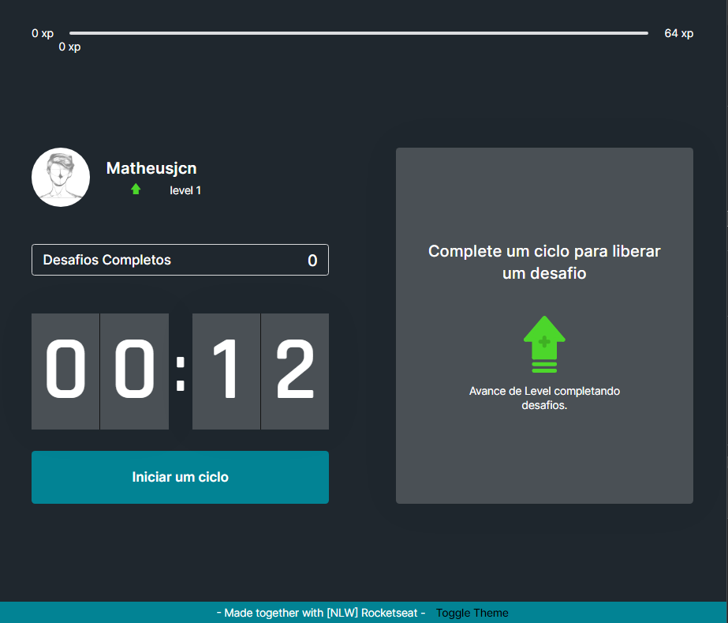

## Move-it

#### Aplicação construída durante o NLW-4. Utilizando NextJs com Typescript;

O projeto, baseado em algumas metodologias, busca uma melhor relação entre o tempo de trabalho e as atividades físicas. Propondo
várias atividades que podem ser intercaladas com as tarefas.

Para iniciar o projeto, após o clone, instale as dependências:

- `npm install`

Após isso, inicie a aplicação com o comando:

- `npm run dev`

### Aprimoramentos [Next Level]

- Adição do Footer;
- Temas Padrões;
  Light Theme | Dark Theme
  :-------------------------:|:-------------------------:
   | 

- Além de algumas funções de responsividade;
